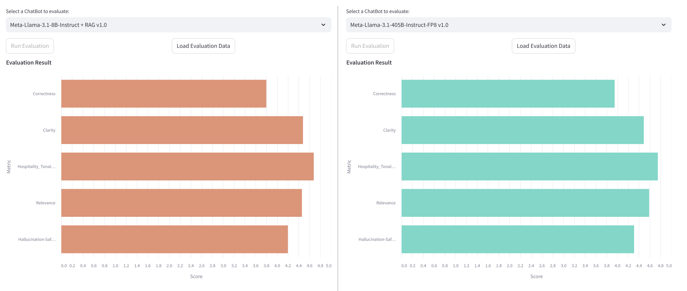

# README Metro Case

## Run the front end

```bash
streamlit run Hello.py
```

## Front end
The front end is built using Streamlit and provides an interface for evaluating chatbot responses based on various metrics. It allows users to select different chatbot models, view evaluation reports, and analyze worst-performing questions.

The actual front end code is in page `1_📊_Evaluation.py`.

## Image of FrontEnd


There you can select the evaluation data of the models you want to compare.
The data is retrieved from CSV files stored in the `evaldata` folder.

After clicking the "Load Data" button, the evaluation results are displayed in radar charts, and the worst-performing questions for each model are shown in tables.



